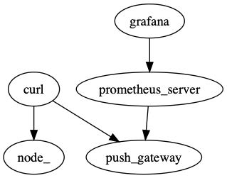

# Performance Harness



## Deployment

1. Fill out Ansible playbook variables in:

 * [`deployment/roles/drone/vars/main.yml`](deployment/roles/drone/vars/main.yml)
 * [`deployment/roles/hubot/vars/main.yml`](deployment/roles/hubot/vars/main.yml)
 * [`deployment/roles/metrics/vars/main.yml`](deployment/roles/metrics/vars/main.yml)

2. Execute the Ansible playbook:

```
$ cd deployment
$ ansible-playbook --inventory=<HOST>, --user=<USER> --private-key=<SSH_PRIVATE_KEY_PATH> --ask-vault-pass site.yml
```

Side note: You may also want to pass `--extra-vars "checkout_commit=<BRANCH>"`
to test out a PR against the Ansible playbook itself.

3. In the cloud provider UI, configure DNS records for Drone and Grafana

    1. Assign a static IP address to the perf machine
    2. Add `A` record binding a name to the static IP address
    3. Add `CNAME` records for `drone.<DOMAIN>` and `grafana.<DOMAIN>` pointing to the static IP address.


4. Configure Grafana password by opening up the its UI and logging in as
   admin.
